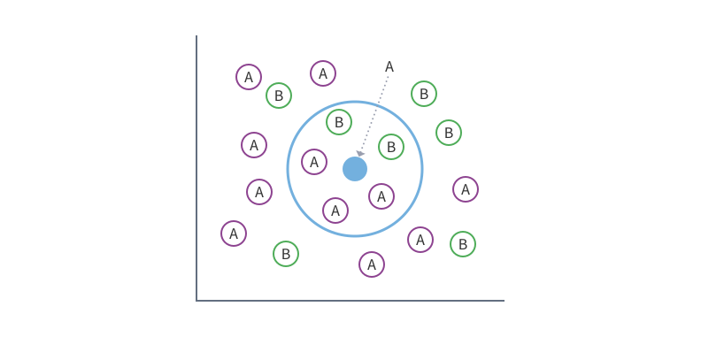
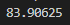

# Student Analyzer

## Overview
The Student Analyzer is a sophisticated tool designed to analyze student databases, providing valuable insights into potential customers for educational courses. While its primary function may appear simple - generating numerical outputs - its implications for market analysis are profound.

## Functionality
This program leverages advanced algorithms based on the nearest neighbors principle to analyze extensive data frames of student information. By employing this methodology, it identifies patterns and correlations, thereby facilitating predictions regarding prospective purchasers of educational courses.

## Operation
The program operates by constructing a graphical representation, employing a nearest neighbors approach to identify similarities based on various parameters. Despite its apparent simplicity, the computational demands can be substantial, as evidenced by instances where processing thousands of neighbors momentarily strained system resources.

### Performance Metrics
| Number of Neighbors | Success Rate |
|----------------------|--------------|
| 4799                 | ~54%         |
| 3                    | ~70%         |
| 2000                 | 82%          |
| 1600                 | ~83%         |
| 999                  | up to 84.1% |

Presently, the program yields results with an accuracy ranging from 80% to 84%. This implies that there is an 80% to 84% probability that the program will correctly identify whether a student is a potential purchaser of educational courses.

## Enhancements and Challenges
To improve accuracy, various strategies have been employed, including augmenting the dataset with additional features such as language proficiency. While this approach introduces complexities, particularly due to the inherently numerical nature of machine learning models, creative solutions have been devised to encode non-numeric data effectively. Specifically, the representation of language proficiency has been transformed into numerical features, thereby enabling seamless integration into the analytical framework.

In conclusion, the Student Analyzer represents a fusion of advanced computational techniques and domain-specific knowledge, offering invaluable insights for educational marketing strategies.
